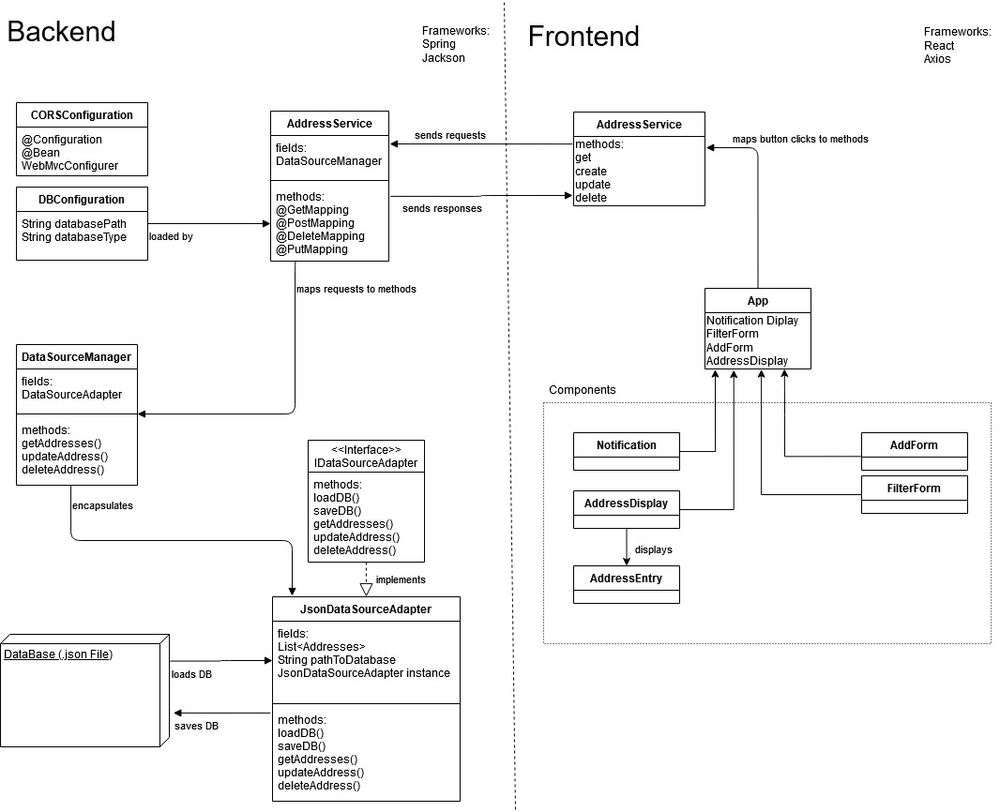

# Rest Demo

This is a demo project showing a java backend based on the spring framework.
The frontend is realized by a simple react app.

The address entry database is implemented by a db.json file. 
The server backend is running on "http://localhost:8080" and allows the following Http Requests
- GET
- Post
- DELETE
- PUT

The structure of the project is visualized in the diagram below.

